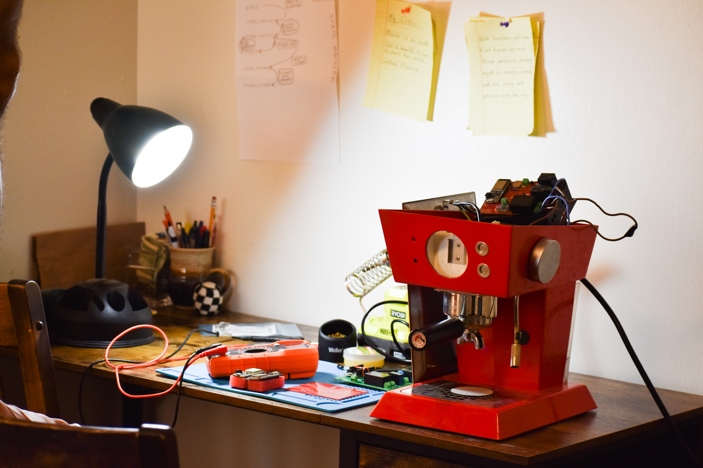
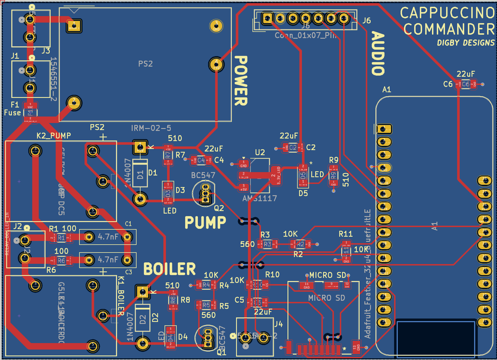
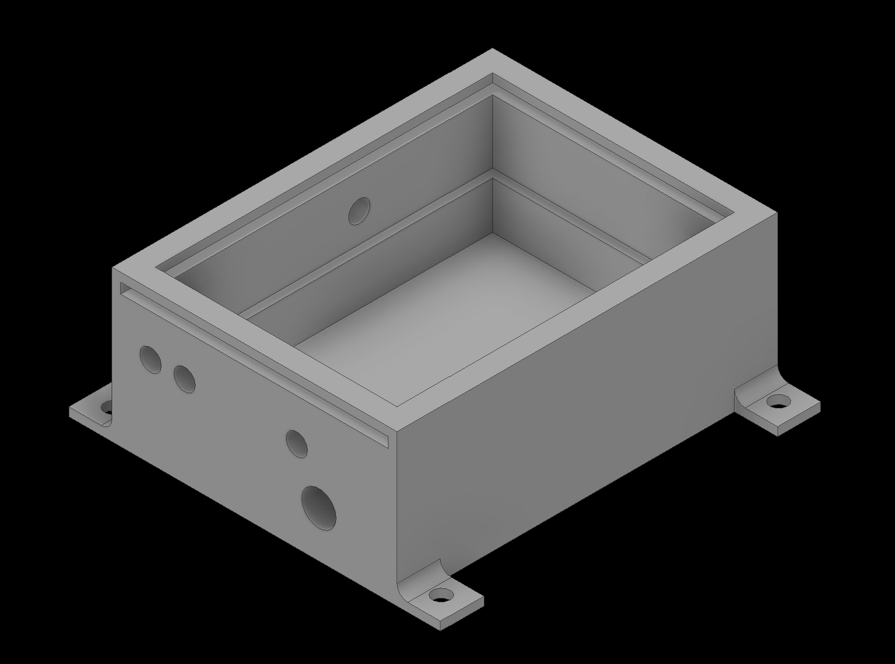
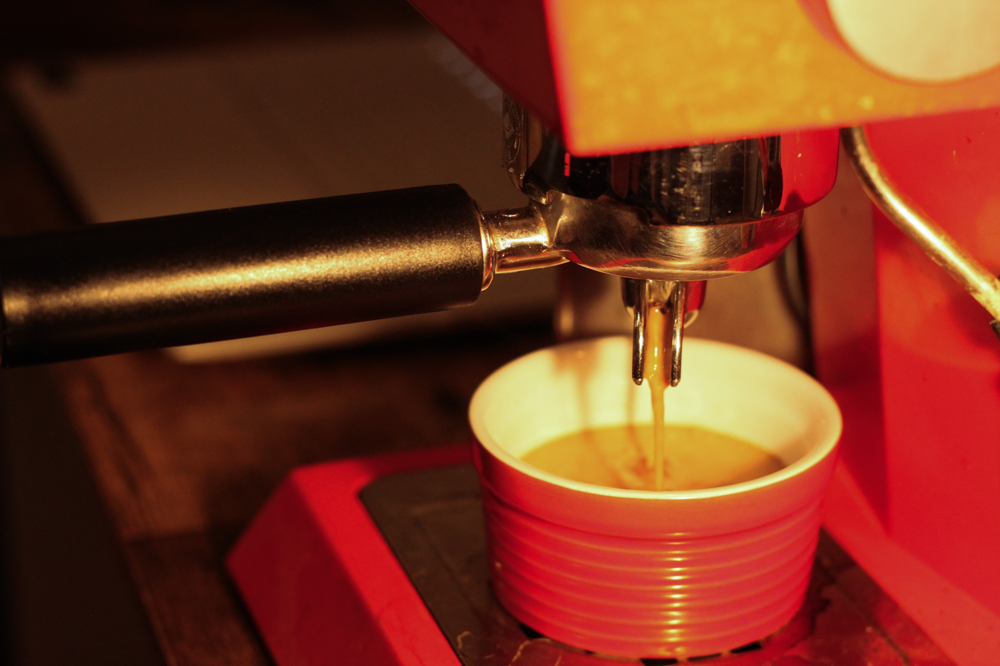

☕ The Coffee Machine Project

Because pushing buttons is easier than being a barista.
What is this?

A highly over-engineered coffee machine powered by:

    ESP32 Microcontroller (Integrated radio)

    Web interface built with Micro Python

    Custom built PCB driving PUMP and BOILER relays

    MICRO SD for music storage

    Questionable life choices

Features

    Heats water (on purpose)

    Pumps water (mostly where you want it)

    Steams water (or is it just steam at that point? Steams steam?)

    Pulls a brilliant double shot (allegedly)

    Web UI so you can brew from your couch

    Pretty lights

Requirements

    Low expectations

    Coffee - has to be grind size 19, no more no less or it don't work...

    Patience

Warning

May cause excessive caffeine consumption and minor debugging-induced existential crises.

The PCB:

The 3D Printed Housing:

Sweet, sweet success:

